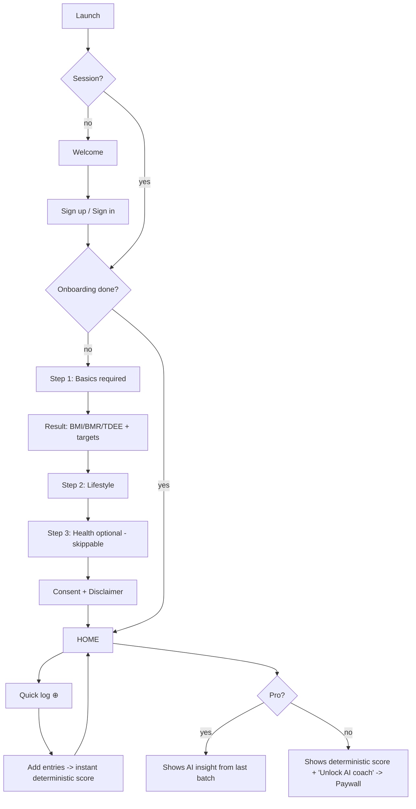
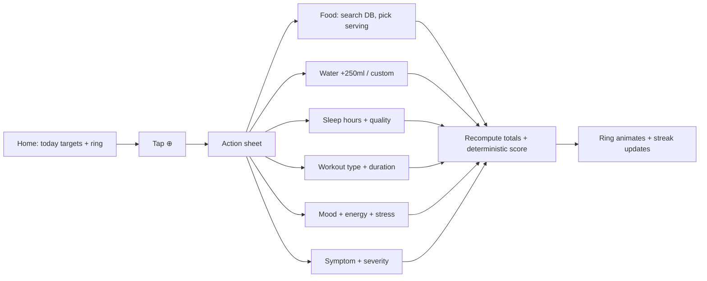
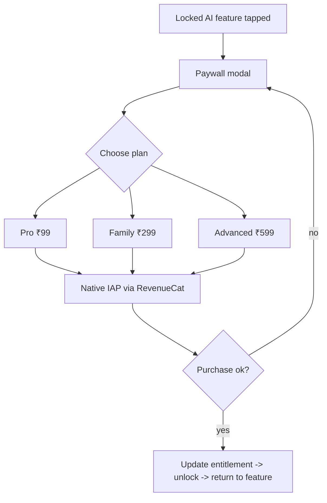

# App Flow — Saathi

**Companion docs:** UI_UX_DESIGN.md, PRD.md, TRD.md

---

## 1. Navigation structure (Expo Router)

```
app/
  (auth)/
    welcome           # value prop + Get started / Sign in
    sign-in
    sign-up
  (onboarding)/
    step-1-basics     # name, age, sex, height, weight, goal  (required)
    result            # instant BMI/BMR/TDEE + targets  ← AHA moment
    step-2-lifestyle  # diet, activity, target weight
    step-3-health     # optional/sensitive (skippable)
    consent           # DPDP consent + disclaimer
  (tabs)/
    index             # HOME — Today Ring + insight + quick log
    journal           # day's log (add/edit entries)
    insights          # trends, weekly/monthly reports
    profile           # account, goals, health profile, settings, subscription
  log/
    food              # food search + add (modal)
    water             # quick add (modal)
    sleep             # (modal)
    workout           # (modal)
    mood              # mood + energy + stress (modal)
    symptom           # (modal)
  report/[id]         # full weekly/monthly report + PDF/share
  paywall             # Pro/Family/Advanced (modal, contextual)
```

**Tab bar:** Home · Journal · ⊕ (center log) · Insights · Profile.
The center **⊕** opens a quick-log action sheet (Food / Water / Sleep / Workout / Mood / Symptom).

---

## 2. Top-level flow



---

## 3. Onboarding flow (progressive)

1. **Welcome** → value prop, "Get started."
2. **Sign up** (email/Google; phone OTP optional). Allow Step 1 *before* hard signup if you want a softer funnel; otherwise sign up first.
3. **Step 1 — Basics (required):** name, age, sex, height, weight, primary goal. → write `profiles`.
4. **Result:** compute and show BMI, BMR, TDEE, ideal-weight range, daily targets (calorie/protein/water/sleep). This is the activation moment — make it feel earned.
5. **Step 2 — Lifestyle:** diet type, activity level, target weight.
6. **Step 3 — Health (optional, skippable):** conditions, family history, allergies, medications, baselines. "Skip for now" is prominent; can complete later from Profile.
7. **Consent:** DPDP consent toggle + medical disclaimer; store `consent_dpdp_at`. → `onboarding_complete = true` → Home.

Drop-off rule: never block reaching Home on Step 3.

---

## 4. Daily core loop



- All logging is **optimistic + offline-first** (TRD §7); syncs in background.
- Deterministic score and ring update **instantly** — no AI/network needed.
- AI insight for *yesterday* appears on morning open (generated overnight in batch). It is never blocking.

---

## 5. Insights & reports flow

- **Insights tab:** trend charts (weight, steps, sleep, water, protein, score) with range toggles; cards for "This week" and "This month."
- **Weekly report** (Pro): generated Sunday night → notification "Your week in review" → opens `report/[id]`.
- **Monthly report** (Pro): generated month-end → includes goal generator results for next month → **Export PDF** / **Share link** (signed URL + `share_token`).
- Free users see deterministic trends but locked AI report cards → contextual Paywall.

---

## 6. Subscription / paywall flow



- Paywall is **contextual** (shown at the moment a value is locked), not a wall on launch.
- Annual toggle highlighted (cheaper/month, reduces churn).
- RevenueCat webhook → updates `subscriptions`; client refreshes entitlement on focus.
- Restore purchases available in Profile.

---

## 7. Family flow (v1.1)

Admin creates group → invites members (link/code) → members accept → admin sees **Family dashboard** (each member's daily status, streaks, alerts). Per-member reports gated by family RLS (BACKEND_SCHEMA.md §10). Health alerts pushed to admin.

---

## 8. Notification touchpoints

- **Morning:** today's targets + motivational line.
- **Afternoon:** water reminder / move reminder (only if behind).
- **Night:** "Close your day" journal reminder (only if incomplete).
- **Event:** weekly/monthly report ready; family alert (v1.1).
All times user-configurable; respect quiet hours; only nudge when actionable.

---

## 9. Empty & edge states

- **No log yet today:** ring empty with friendly prompt "Start with a glass of water" → quick log.
- **AI not ready yet:** show deterministic score + "Your coach is reviewing last night's data."
- **Offline:** banner; logging still works; sync indicator.
- **AI/API failure:** deterministic score + templated nudge; never an error wall.
